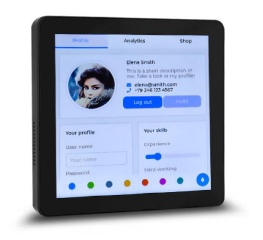
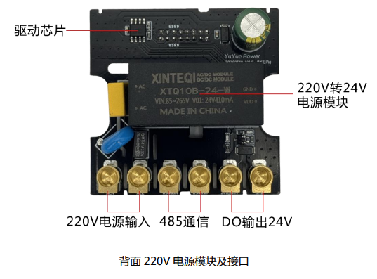
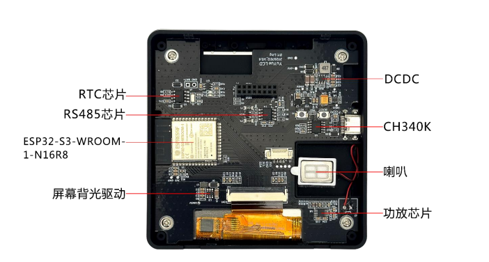
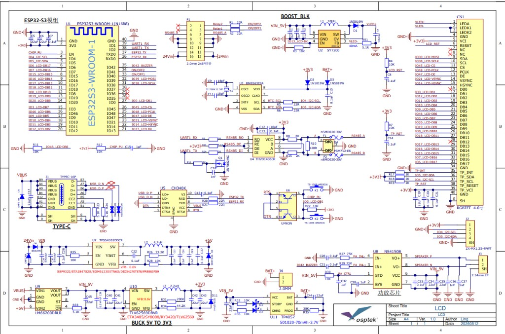

<p align="left"></p>

<h1 align="center">OSPTEK ESP32-S3-Touch-4-220V 触摸屏面板</h1>

<p align="center"><b>4 寸触摸 · 220V 供电 · RS485 · Wi-Fi / BLE</b></p>

<p align="center"><a href="./README_EN.md">English</a> | 简体中文 · <a href="../../README.md">系列索引</a></p>

<p align="center">
  
  
  
  
</p>

<p align="center"></p>

## 目录

- [产品简介](#产品简介)
- [产品特性](#产品特性)
- [应用场景](#应用场景)
- [规格参数](#规格参数)
- [屏幕](#屏幕)
- [硬件资源](#硬件资源)
- [开发说明](#开发说明)
- [示例工程](#示例工程)
- [预编译固件](#预编译固件)
- [仓库结构](#仓库结构)
- [相关资料](#相关资料)
- [购买链接](#购买链接)
- [技术支持](#技术支持)

---

## 产品简介

> 📌 本版本对应 **ESP32-S3-Touch-4-220V**。参数以仓库 `docs/` 内使用指南为准。

OSPTEK **ESP32-S3-Touch-4-220V** 是一款集成 **4 英寸 RGB 触摸显示**、**ESP32-S3**（Wi-Fi / BLE）主控、**220V 交流输入电源模块**以及 **RS485** 通信接口的智能触摸控制平台，适用于智能家居控制、工业控制面板、设备联网与人机交互等场景。

## 产品特性

- **4 寸方屏触摸**：YDP395BT003-V4，480×480，ST7701S + 电容触摸
- **ESP32-S3 主控**：ESP32-S3-WROOM-1-N16R8，**16 MB Flash + 8 MB PSRAM**，Wi-Fi 与 BLE 5.0
- **220V 供电**：AC **85~265 V** 输入，DC **24 V** 输出
- **RS485**：工业现场通信接口
- **USB Type-C**：程序下载、调试及供电
- **喇叭**：声音提示 / 播放

## 应用场景

- 智能家居控制终端
- 工业设备控制面板
- 智能电力控制系统
- IoT 物联网网关
- 自动化设备人机界面

## 规格参数

### 主控与存储

| 项目 | 规格 |
| ---- | ---- |
| 产品型号 | ESP32-S3-Touch-4-220V |
| 主控模组 | ESP32-S3-WROOM-1-N16R8 |
| Flash | 16 MB |
| PSRAM | 8 MB |
| 无线 | Wi-Fi、Bluetooth LE 5.0 |

### 显示与触摸

| 项目 | 规格 |
| ---- | ---- |
| 屏模组 | YDP395BT003-V4（约 3.95 英寸） |
| 分辨率 | 480×480 |
| 驱动 IC | ST7701S |
| 显示接口 | RGB 18-bit |
| 触摸 | 电容触摸（FT6336U，I²C） |
| 亮度 | 典型 350 cd/m² |

完整模组参数见下方 [屏幕](#屏幕)。

### 电源与接口

| 项目 | 规格 |
| ---- | ---- |
| 交流输入 | AC 85~265 V（端子：220V 电源输入） |
| 直流输出 | 24 V DC（端子：DO / 24V 输出；电源模块典型 24 V / 410 mA） |
| RS485 | RS485A / RS485B |
| USB | Type-C（下载、调试、供电） |
| 音频 | 板载喇叭 |

> ⚠ 220V 交流输入属高压区域，禁止带电操作；首次使用前请确认接线正确。建议由具备电气操作经验的人员安装调试。详见[使用指南](./docs/ESP32-S3-TOUCH-4-220V_%E4%BD%BF%E7%94%A8%E6%8C%87%E5%8D%97260731.pdf)。

## 屏幕

本面板搭载 OSPTEK 自产 TFT 模组 **YDP395BT003-V4**，驱动 IC 为 **ST7701S**，通过主板 LCD FPC 连接；触摸为电容方案（I²C，FT6336U）。

### 模组规格（YDP395BT003-V4）

| 项目 | 规格 |
| ---- | ---- |
| 模组型号 | YDP395BT003-V4 |
| 尺寸 | 3.95 英寸（对角线） |
| 显示模式 | Normally Black |
| 分辨率 | 480（H）RGB × 480（V） |
| 点距 | 153 μm × 153 μm |
| 有效显示区 | 71.86 × 70.18 mm |
| 模组外形 | 83.85 × 83.85 × 3.27 mm |
| 排列 | RGB 垂直条纹 |
| 接口 | RGB 18-bit（含 HSYNC / VSYNC / DE / DCLK）；驱动初始化为 3-wire SPI（SDA / SCL / CS） |
| 驱动 IC | ST7701S |
| 亮度 | 典型 350 cd/m²（最小约 300） |
| 视角 | 全视角（典型约 80°） |
| 对比度 | 典型约 1000:1 |
| 背光 | 8 颗白光 LED（背光供电典型约 12 V / 40 mA） |
| 工作温度 | −20 ℃ ~ +70 ℃ |
| 存储温度 | −30 ℃ ~ +80 ℃ |

触摸侧经同一 FPC 引出 `TP_SCL` / `TP_SDA` / `TP_INT` / `TP_RESET` 等信号，供电典型 2.8–3.3 V。

### 屏幕相关资料

- [屏模组规格书 YDP395BT003-V4（PDF）](./docs/YDP395BT003-V4.pdf)
- [总成图 CAD（YDP395BT003-V4）](./docs/YDP395BT003-V4.dwg)
- [驱动 IC ST7701S Datasheet（PDF）](./docs/ST7701S_SPEC_V1.3.pdf)
- [触摸 IC FT6336U Datasheet（PDF）](./docs/FT6336U_DataSheet_V1.1.pdf)
- [初始化序列（文本）](./docs/BOE3.95_480x480_ST7701S_init.txt)

## 硬件资源

### 外观与电源板

<p align="center">
  
  &nbsp;&nbsp;
  
</p>

### 主板标注

<p align="center"></p>

板载可见资源（标注图）：ESP32-S3-WROOM-1-N16R8、RS485、CH340K、DCDC、屏幕背光驱动、RTC、功放与喇叭、USB Type-C 等。

### 原理图预览

<p align="center"></p>

完整原理图 PDF：

- [YuYue LCD V1.0 原理图（PDF）](./docs/YuYue%20LCD_V1.0.pdf)
- [YuYue Power V0.8 原理图（PDF）](./docs/YuYue%20Power%20V0.8.pdf)

完整说明与接线见使用指南 PDF。

## 开发说明

1. 使用 **USB Type-C** 连接电脑进行程序下载与调试。
2. **验证显示（推荐）**：直接烧录仓库内预编译固件，见下方 [预编译固件](#预编译固件)。
3. **二次开发**：使用 ESP-IDF 编译 [示例工程](#示例工程)（与 Classic 同源）。

⚠ 220V 交流输入属高压区域，禁止带电操作；首次使用前请确认接线正确。

详细步骤与安全注意事项见：

- [使用指南（中文 PDF）](./docs/ESP32-S3-TOUCH-4-220V_%E4%BD%BF%E7%94%A8%E6%8C%87%E5%8D%97260731.pdf)
- [User Guide (English PDF)](./docs/ESP32-S3-Touch-4-220V_User%20Guide260731.pdf)

乐鑫官方工具与入门：

- [Flash 下载工具（Windows）](https://www.espressif.com/zh-hans/support/download/other-tools)
- [ESP-IDF 快速入门 · ESP32-S3（中文）](https://docs.espressif.com/projects/esp-idf/zh_CN/latest/esp32s3/get-started/)
- [ESP-IDF Get Started · ESP32-S3（English）](https://docs.espressif.com/projects/esp-idf/en/latest/esp32s3/get-started/)

## 示例工程

| 说明 | 路径 |
| ---- | ---- |
| 点屏 / LVGL Demo（RGB ST7701，480×480，触摸 FT6336U） | [`examples/esp32s3-3.95-tft-480x480-rgb-st7701-bringup/`](./examples/esp32s3-3.95-tft-480x480-rgb-st7701-bringup/) |

> 该示例与 Classic 版本同源（同一屏模组与触摸方案）。

在已安装 ESP-IDF 的环境下：

```bash
cd examples/esp32s3-3.95-tft-480x480-rgb-st7701-bringup
idf.py set-target esp32s3
idf.py build
idf.py -p <串口> flash monitor
```

组件依赖由 `main/idf_component.yml` 管理，首次编译会自动拉取。

## 预编译固件

| 文件 | 烧录地址 | 说明 |
| ---- | -------- | ---- |
| [`firmware/esp32-s3-touch-lcd-4.bin`](./firmware/esp32-s3-touch-lcd-4.bin) | **`0x0`** | 合并烧录镜像（bootloader + 分区表 + 应用），对应上述点屏示例 |

Flash 参数与工程配置一致：芯片 **ESP32-S3**，Flash **16 MB**，**DIO**，**80 MHz**。合并包从地址 **`0x0`** 整包写入。

### 方式一：Flash 下载工具（Windows，推荐上手）

1. 下载并打开乐鑫 **[Flash 下载工具](https://www.espressif.com/zh-hans/support/download/other-tools)**。
2. `ChipType` 选 **ESP32-S3**，`WorkMode` 选 Develop，`LoadMode` 选 UART。
3. 勾选一行，固件选 [`firmware/esp32-s3-touch-lcd-4.bin`](./firmware/esp32-s3-touch-lcd-4.bin)，地址填 **`0x0`**。
4. SPI SPEED / SPI MODE / FLASH SIZE 按上表选择（80 MHz、DIO、16 MB）。
5. 选择正确 COM 口，点 **START** 烧录。

### 方式二：esptool（命令行）

```bash
esptool.py --chip esp32s3 -p <串口> write_flash 0x0 firmware/esp32-s3-touch-lcd-4.bin
```

## 仓库结构

```text
esp32-s3-touch-lcd-4/                                # 仓库根（导航见 ../../README.md）
└── versions/
    └── ESP32-S3-Touch-4-220V/                       # 本型号完整资料
        ├── README.md
        ├── README_EN.md
        ├── images/
        ├── docs/
        ├── firmware/
        └── examples/
```

## 相关资料

- [使用指南（中文 PDF）](./docs/ESP32-S3-TOUCH-4-220V_%E4%BD%BF%E7%94%A8%E6%8C%87%E5%8D%97260731.pdf)
- [User Guide (English PDF)](./docs/ESP32-S3-Touch-4-220V_User%20Guide260731.pdf)
- [YuYue LCD V1.0 原理图（PDF）](./docs/YuYue%20LCD_V1.0.pdf)
- [YuYue Power V0.8 原理图（PDF）](./docs/YuYue%20Power%20V0.8.pdf)
- [屏模组规格书 YDP395BT003-V4（PDF）](./docs/YDP395BT003-V4.pdf)
- [总成图 CAD（YDP395BT003-V4）](./docs/YDP395BT003-V4.dwg)
- [驱动 IC ST7701S Datasheet（PDF）](./docs/ST7701S_SPEC_V1.3.pdf)
- [触摸 IC FT6336U Datasheet（PDF）](./docs/FT6336U_DataSheet_V1.1.pdf)
- [初始化序列（文本）](./docs/BOE3.95_480x480_ST7701S_init.txt)

### 芯片资料（乐鑫官方）

- [ESP32-S3 系列产品页（中文）](https://www.espressif.com/zh-hans/products/socs/esp32-s3)
- [ESP-IDF 编程指南 · ESP32-S3（中文）](https://docs.espressif.com/projects/esp-idf/zh_CN/latest/esp32s3/index.html)

## 购买链接

<p align="center">
  <a href="https://shop110742373.taobao.com/"></a>
  &nbsp;&nbsp;
  <a href="https://www.aliexpress.com/store/1105701619"></a>
</p>

**国内（淘宝）**

- 店铺：[鱼鹰光电工厂店](https://shop110742373.taobao.com/)

**海外（AliExpress）**

- 店铺：[OSPTEK Official Store](https://www.aliexpress.com/store/1105701619)

---

## 技术支持

- 技术支持 / 产品咨询：<luyu@osptek.com>
- QQ 技术交流群：**985881096**
- 公司官网：<https://osptek.com/>
- 有任何问题，都可以在本仓库 Issues 中提问

---

<p align="center"><sub>© 2026 OSPTEK 鱼鹰光电 · 本仓库资料采用 CC BY 4.0 许可</sub></p>
