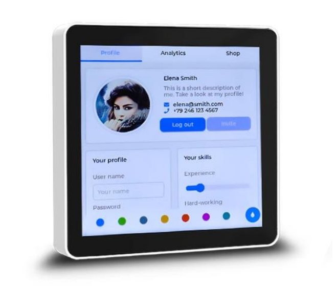

<p align="left"></p>

<h1 align="center">OSPTEK ESP32-S3-Touch-4-Classic 触摸屏面板</h1>

<p align="center"><b>86 型面板 · 触摸交互 · 一路 RS485</b></p>

<p align="center"><a href="./README_EN.md">English</a> | 简体中文 · <a href="../../README.md">系列索引</a></p>

<p align="center">
  
  
  
  
</p>

<p align="center"></p>

## 目录

- [产品简介](#产品简介)
- [产品特性](#产品特性)
- [应用场景](#应用场景)
- [规格参数](#规格参数)
- [屏幕](#屏幕)
- [硬件资源](#硬件资源)
- [快速开始](#快速开始)
- [示例工程](#示例工程)
- [预编译固件](#预编译固件)
- [仓库结构](#仓库结构)
- [相关资料](#相关资料)
- [购买链接](#购买链接)
- [技术支持](#技术支持)

---

## 产品简介

> 📌 本文档对应 **ESP32-S3-Touch-4-Classic**（原理图：`ESP32-S3-Touch基础板V1.0`）。本目录内点屏示例 / 预编译固件已在 Classic 板上验证。

OSPTEK **ESP32-S3-Touch-4-Classic** 是一款搭载 ESP32-S3（2.4 GHz Wi-Fi + Bluetooth LE 5）模组的 **4 英寸触摸屏面板**，集成 **16 MB Flash** 与 **8 MB PSRAM**，板载 **YDP395BT003-V4**（约 3.95"）**480×480** RGB 电容触摸屏（驱动 **ST7701S**）。

主控模组为 **ESP32-S3-WROOM-1-N16R8**，板载一路 **RS485**、USB Type-C（供电 / 烧录）、I²C 与蜂鸣器等，适合作为智能中控、交互面板等方案的整机形态产品。

## 产品特性

- **4 寸方屏触摸**：YDP395BT003-V4，480×480，ST7701S + 电容触摸，适合 86 型面板人机界面
- **ESP32-S3 主控**：Wi-Fi + BLE 5，16 MB Flash + 8 MB PSRAM
- **工业总线**：板载 RS485
- **供电**：USB Type-C；接线端口支持宽压输入（见原理图）
- **调试**：CH340K USB 转串口
- **扩展**：I²C、LCD FPC、蜂鸣器等（见原理图）

## 应用场景

- 智能家居中控 / 86 型交互面板
- 家庭网关与本地人机界面
- 工业控制与设备状态显示
- 智能灯控与楼宇面板

## 规格参数

### 主控与存储

| 项目 | 规格 |
| ---- | ---- |
| 产品型号 | ESP32-S3-Touch-4-Classic |
| 主板 / 原理图 | ESP32-S3-Touch 基础板 V1.0 |
| 主控模组 | ESP32-S3-WROOM-1-N16R8 |
| Flash | 16 MB |
| PSRAM | 8 MB |
| 无线 | 2.4 GHz Wi-Fi、Bluetooth LE 5 |

### 显示与触摸

概览如下；完整模组参数、驱动与触摸说明见 [屏幕](#屏幕)。

| 项目 | 规格 |
| ---- | ---- |
| 屏模组 | YDP395BT003-V4（约 3.95 英寸） |
| 分辨率 | 480×480 |
| 驱动 IC | ST7701S |
| 显示接口 | RGB 18-bit |
| 触摸 | 电容触摸（FT6336U，I²C） |
| 亮度 | 典型 350 cd/m² |

### 接口与电源

| 项目 | 规格 |
| ---- | ---- |
| USB | Type-C（供电、烧录） |
| USB 转串口 | CH340K |
| RS485 | 板载 |
| 传感器 | I²C |
| 听觉 | 板载蜂鸣器 |

电源树、收发器件与精确电气参数见 [原理图](./docs/ESP32-S3-Touch基础板V1.0.pdf)。

## 屏幕

本面板搭载 OSPTEK 自产 TFT 模组 **YDP395BT003-V4**，驱动 IC 为 **ST7701S**，通过主板 LCD FPC 连接；触摸为电容方案（I²C，FT6336U）。

### 模组规格（YDP395BT003-V4）

| 项目 | 规格 |
| ---- | ---- |
| 模组型号 | YDP395BT003-V4 |
| 尺寸 | 3.95 英寸（对角线） |
| 显示模式 | Normally Black |
| 分辨率 | 480（H）RGB × 480（V） |
| 点距 | 153 μm × 153 μm |
| 有效显示区 | 71.86 × 70.18 mm |
| 模组外形 | 83.85 × 83.85 × 3.27 mm |
| 排列 | RGB 垂直条纹 |
| 接口 | RGB 18-bit（含 HSYNC / VSYNC / DE / DCLK）；驱动初始化为 3-wire SPI（SDA / SCL / CS） |
| 驱动 IC | ST7701S |
| 亮度 | 典型 350 cd/m²（最小约 300） |
| 视角 | 全视角（典型约 80°） |
| 对比度 | 典型约 1000:1 |
| 背光 | 8 颗白光 LED（背光供电典型约 12 V / 40 mA） |
| 工作温度 | −20 ℃ ~ +70 ℃ |
| 存储温度 | −30 ℃ ~ +80 ℃ |

触摸侧经同一 FPC 引出 `TP_SCL` / `TP_SDA` / `TP_INT` / `TP_RESET` 等信号，供电典型 2.8–3.3 V。

### 屏幕相关资料

- [屏模组规格书 YDP395BT003-V4（PDF）](./docs/YDP395BT003-V4.pdf)
- [总成图 CAD（YDP395BT003-V4）](./docs/YDP395BT003-V4.dwg)
- [驱动 IC ST7701S Datasheet（PDF）](./docs/ST7701S_SPEC_V1.3.pdf)
- [触摸 IC FT6336U Datasheet（PDF）](./docs/FT6336U_DataSheet_V1.1.pdf)
- [初始化序列（文本）](./docs/BOE3.95_480x480_ST7701S_init.txt)

## 硬件资源

### 板载资源概览

| 资源 | 说明 |
| ---- | ---- |
| ESP32-S3-WROOM-1-N16R8 | Wi-Fi + BLE MCU 模组 |
| RS485 | 板载收发 |
| USB 转换 | CH340K |
| LCD 连接器 | FPC，连接 LCD |
| 蜂鸣器 | 板载 |

### 原理图

- [ESP32-S3-Touch 基础板 V1.0 原理图（PDF）](./docs/ESP32-S3-Touch基础板V1.0.pdf)

## 快速开始

1. 准备：ESP32-S3-Touch-4-Classic、可用的 USB 数据线（需支持数据传输，不仅充电）、电脑（Windows / Linux / macOS）。
2. 用 USB 连接电脑与面板的 USB 口。
3. **验证显示（推荐）**：直接烧录仓库内预编译固件，见下方 [预编译固件](#预编译固件)。
   - Windows 可用乐鑫官方图形工具 **[Flash 下载工具](https://www.espressif.com/zh-hans/support/download/other-tools)**（Flash Download Tools）烧录。
   - 使用说明见：[Flash 下载工具用户指南 · ESP32-S3](https://docs.espressif.com/projects/esp-test-tools/zh_CN/latest/esp32s3/production_stage/tools/flash_download_tool.html)
4. **二次开发**：使用 ESP-IDF 编译 [示例工程](#示例工程)（自动下载依赖串口 DTR/RTS，详见原理图）。

详细硬件说明见：

- [ESP32-S3-Touch 基础板 V1.0 原理图（PDF）](./docs/ESP32-S3-Touch基础板V1.0.pdf)

乐鑫官方工具与入门：

- [Flash 下载工具（Windows）](https://www.espressif.com/zh-hans/support/download/other-tools)
- [ESP-IDF 快速入门 · ESP32-S3（中文）](https://docs.espressif.com/projects/esp-idf/zh_CN/latest/esp32s3/get-started/)
- [ESP-IDF Get Started · ESP32-S3（English）](https://docs.espressif.com/projects/esp-idf/en/latest/esp32s3/get-started/)

## 示例工程

| 说明 | 路径 |
| ---- | ---- |
| 点屏 / LVGL Demo（RGB ST7701，480×480） | [`examples/esp32s3-3.95-tft-480x480-rgb-st7701-bringup/`](./examples/esp32s3-3.95-tft-480x480-rgb-st7701-bringup/) |

> 该示例与预编译固件已在 **Classic** 板上验证。

在已安装 ESP-IDF 的环境下：

```bash
cd examples/esp32s3-3.95-tft-480x480-rgb-st7701-bringup
idf.py set-target esp32s3
idf.py build
idf.py -p <串口> flash monitor
```

组件依赖由 `main/idf_component.yml` 管理，首次编译会自动拉取。

## 预编译固件

| 文件 | 烧录地址 | 说明 |
| ---- | -------- | ---- |
| [`firmware/esp32-s3-touch-lcd-4.bin`](./firmware/esp32-s3-touch-lcd-4.bin) | **`0x0`** | 合并烧录镜像（bootloader + 分区表 + 应用），对应上述点屏示例 |

Flash 参数与工程配置一致：芯片 **ESP32-S3**，Flash **16 MB**，**DIO**，**80 MHz**。合并包从地址 **`0x0`** 整包写入。

### 方式一：Flash 下载工具（Windows，推荐上手）

1. 下载并打开乐鑫 **[Flash 下载工具](https://www.espressif.com/zh-hans/support/download/other-tools)**。
2. `ChipType` 选 **ESP32-S3**，`WorkMode` 选 Develop，`LoadMode` 选 UART。
3. 勾选一行，固件选 [`firmware/esp32-s3-touch-lcd-4.bin`](./firmware/esp32-s3-touch-lcd-4.bin)，地址填 **`0x0`**（不要填成应用分区的 `0x10000`）。
4. SPI SPEED / SPI MODE / FLASH SIZE 按上表选择（80 MHz、DIO、16 MB）。
5. 选择正确 COM 口，点 **START** 烧录。

详细界面说明见：[Flash 下载工具用户指南 · ESP32-S3](https://docs.espressif.com/projects/esp-test-tools/zh_CN/latest/esp32s3/production_stage/tools/flash_download_tool.html)

### 方式二：esptool（命令行）

将 `<串口>` 换成实际端口（如 `/dev/ttyUSB0`、`COM3`）；地址为 **`0x0`**：

```bash
esptool.py --chip esp32s3 -p <串口> write_flash 0x0 firmware/esp32-s3-touch-lcd-4.bin
```

## 仓库结构

```text
esp32-s3-touch-lcd-4/                                # 仓库根（导航见 ../../README.md）
└── versions/
    └── ESP32-S3-Touch-4-Classic/                    # 本型号完整资料
        ├── README.md
        ├── README_EN.md
        ├── images/
        ├── docs/
        ├── firmware/
        └── examples/
```

## 相关资料

### 本产品资料

- [ESP32-S3-Touch 基础板 V1.0 原理图（PDF）](./docs/ESP32-S3-Touch基础板V1.0.pdf)
- [屏模组规格书 YDP395BT003-V4（PDF）](./docs/YDP395BT003-V4.pdf)
- [总成图 CAD（YDP395BT003-V4）](./docs/YDP395BT003-V4.dwg)
- [驱动 IC ST7701S Datasheet（PDF）](./docs/ST7701S_SPEC_V1.3.pdf)
- [触摸 IC FT6336U Datasheet（PDF）](./docs/FT6336U_DataSheet_V1.1.pdf)
- [初始化序列（文本）](./docs/BOE3.95_480x480_ST7701S_init.txt)
- [点屏示例工程](./examples/esp32s3-3.95-tft-480x480-rgb-st7701-bringup/)
- [预编译固件 esp32-s3-touch-lcd-4.bin](./firmware/esp32-s3-touch-lcd-4.bin)

### 系列通用外壳 CAD

86 型外壳（2 层 / 4 层）全型号通用，文件在仓库根 `docs/`。

- [4 层：`0302(1).dwg`](../../docs/86-enclosure-4-layer/0302(1).dwg)
- [4 层：`WSD4寸-2d-1116.dwg`](../../docs/86-enclosure-4-layer/WSD4%E5%AF%B8-2d-1116.dwg)
- [2 层：`3.95-01 PCB.dwg`](../../docs/86-enclosure-2-layer/3.95-01%20PCB.dwg)
- [2 层：`增加开口结构外壳20250102.dwg`](../../docs/86-enclosure-2-layer/%E5%A2%9E%E5%8A%A0%E5%BC%80%E5%8F%A3%E7%BB%93%E6%9E%84%E5%A4%96%E5%A3%B320250102.dwg)
- [2 层：`装配0718(1).DWG`](../../docs/86-enclosure-2-layer/%E8%A3%85%E9%85%8D0718(1).DWG)

### 芯片资料（乐鑫官方）

- [ESP32-S3 系列产品页（中文）](https://www.espressif.com/zh-hans/products/socs/esp32-s3)
- [ESP32-S3 系列产品页（英文）](https://www.espressif.com/en/products/socs/esp32-s3)
- [ESP-IDF 编程指南 · ESP32-S3（中文）](https://docs.espressif.com/projects/esp-idf/zh_CN/latest/esp32s3/index.html)
- [ESP-IDF Programming Guide · ESP32-S3（English）](https://docs.espressif.com/projects/esp-idf/en/latest/esp32s3/index.html)

## 购买链接

<p align="center">
  <a href="https://shop110742373.taobao.com/"></a>
  &nbsp;&nbsp;
  <a href="https://www.aliexpress.com/store/1105701619"></a>
</p>

**国内（淘宝）**

- 店铺：[鱼鹰光电工厂店](https://shop110742373.taobao.com/)

**海外（AliExpress）**

- 店铺：[OSPTEK Official Store](https://www.aliexpress.com/store/1105701619)

---

## 技术支持

如有技术问题或合作需求，欢迎通过以下方式联系我们：

- 技术支持 / 产品咨询：<luyu@osptek.com>
- QQ 技术交流群：**985881096**
- 公司官网：<https://osptek.com/>
- 有任何问题，都可以在本仓库 Issues 中提问

---

<p align="center"><sub>© 2026 OSPTEK 鱼鹰光电 · 本仓库资料采用 CC BY 4.0 许可</sub></p>
