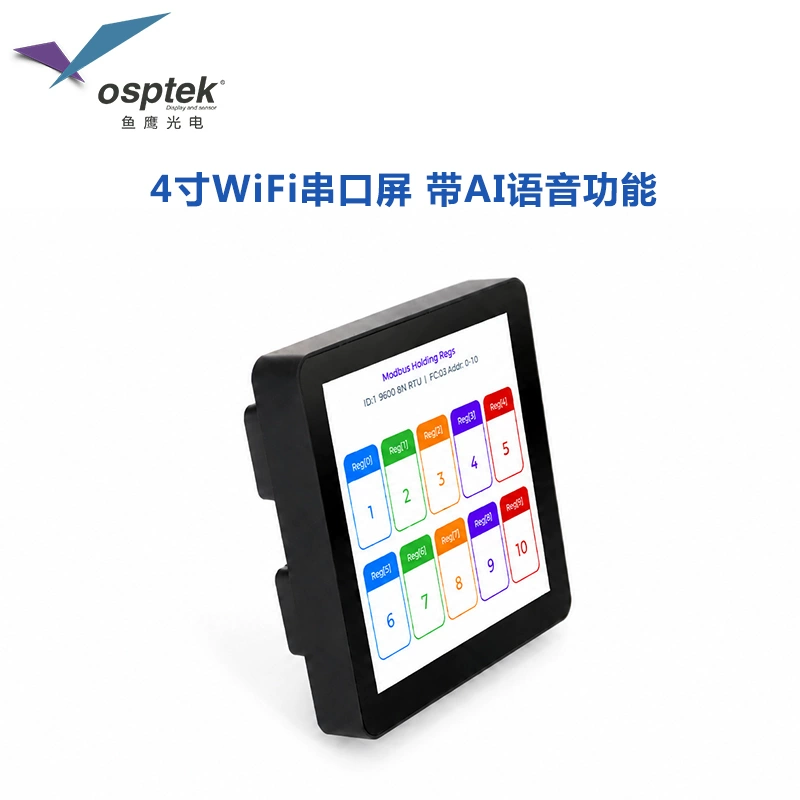
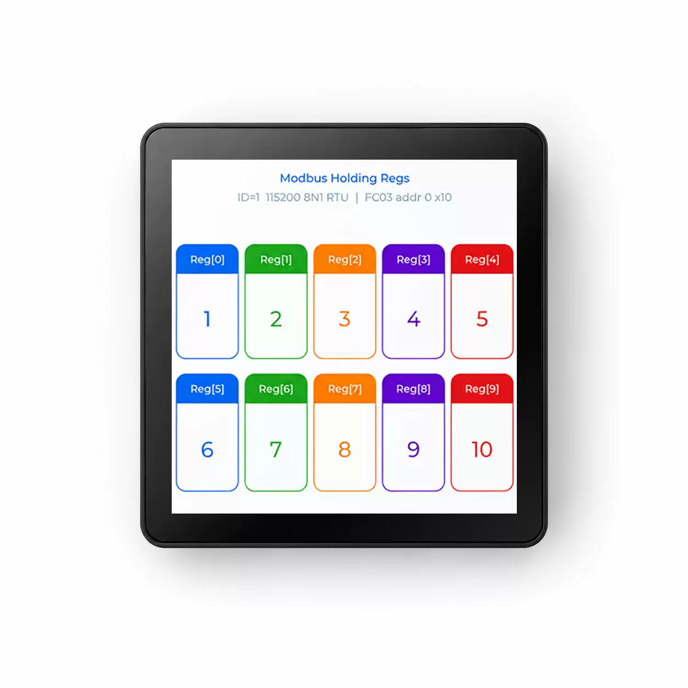
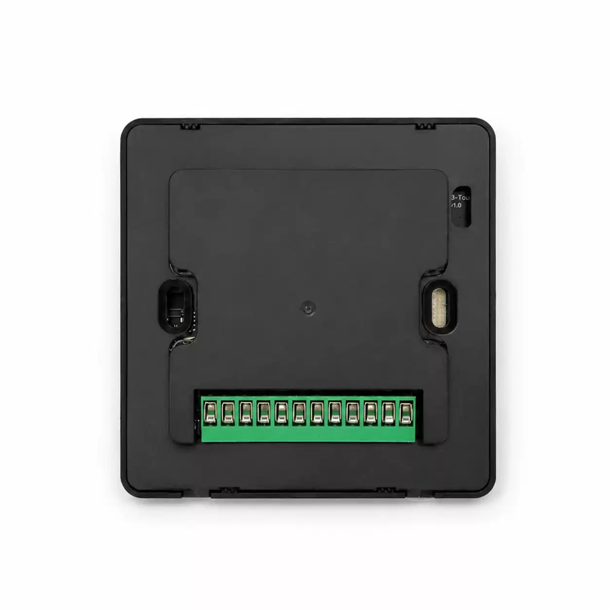
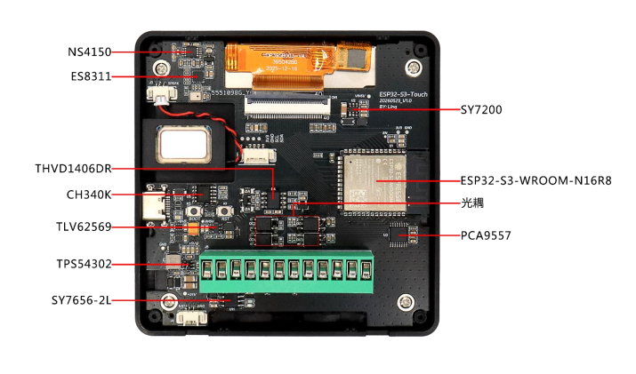
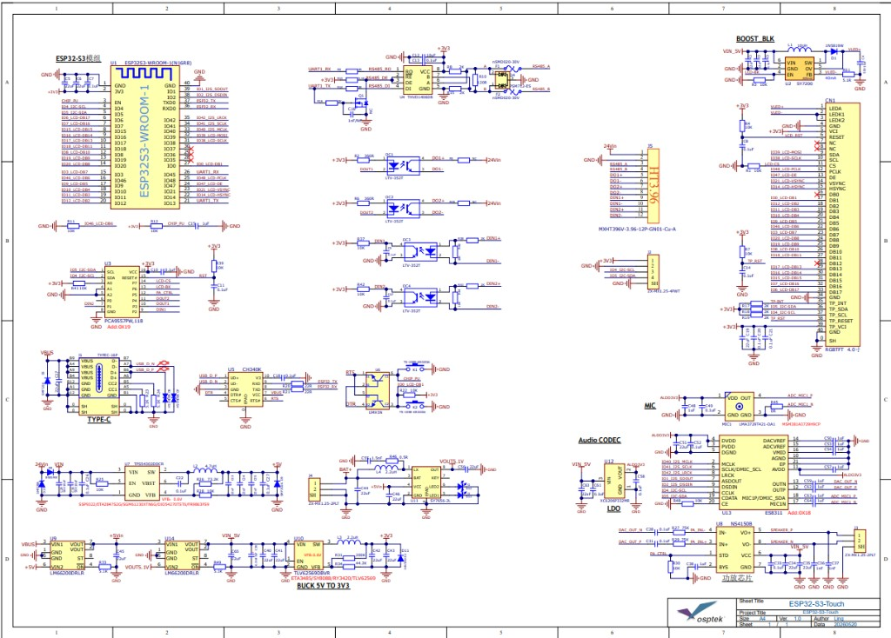

<p align="left"></p>

<h1 align="center">OSPTEK ESP32-S3-Touch-4-Pro 触摸屏面板</h1>

<p align="center"><b>86 型面板 · 触摸交互 · RS485 · 板载音频</b></p>

<p align="center"><a href="./README_EN.md">English</a> | 简体中文 · <a href="../../README.md">系列索引</a></p>

<p align="center">
  
  
  
  
</p>

<p align="center"></p>

## 目录

- [产品简介](#产品简介)
- [产品特性](#产品特性)
- [规格参数](#规格参数)
- [屏幕](#屏幕)
- [硬件资源](#硬件资源)
- [仓库结构](#仓库结构)
- [相关资料](#相关资料)
- [购买链接](#购买链接)
- [技术支持](#技术支持)

---

## 产品简介

> 📌 本文档对应 **ESP32-S3-Touch-4-Pro**（原理图：`ESP32-S3-Touch-Pro_V1.1`）。

OSPTEK **ESP32-S3-Touch-4-Pro** 在 Classic 基础能力之上，增加板载音频链路（**ES8311**、功放 **NS4150B**、MIC / SPEAKER），适合需要本地语音交互的中控面板场景。

主控模组同为 **ESP32-S3-WROOM-1-N16R8**，板载 **RS485**、USB Type-C、I²C 等接口。

## 产品特性

- **4 寸方屏触摸**：YDP395B003-V4，480×480，ST7701S + 电容触摸
- **ESP32-S3 主控**：Wi-Fi + BLE 5，16 MB Flash + 8 MB PSRAM
- **Pro 音频**：ES8311 + NS4150B，麦克风 / 喇叭通路
- **工业总线**：板载 RS485（THVD1406DR）
- **调试**：CH340K USB 转串口
- **隔离 I/O**：光耦隔离数字输入 / 输出；PCA9557 I²C 扩展

## 规格参数

### 主控与存储

| 项目 | 规格 |
| ---- | ---- |
| 产品型号 | ESP32-S3-Touch-4-Pro |
| 主板 / 原理图 | ESP32-S3-Touch-Pro V1.1 |
| 主控模组 | ESP32-S3-WROOM-1-N16R8 |
| Flash | 16 MB |
| PSRAM | 8 MB |
| 无线 | 2.4 GHz Wi-Fi、Bluetooth LE 5 |

### 显示与触摸

| 项目 | 规格 |
| ---- | ---- |
| 屏模组 | YDP395B003-V4（约 3.95 英寸） |
| 分辨率 | 480×480 |
| 驱动 IC | ST7701S |
| 显示接口 | RGB 18-bit |
| 触摸 | 电容触摸（FT5x06 兼容，I²C） |
| 亮度 | 典型 350 cd/m² |

完整模组参数见下方 [屏幕](#屏幕)。

### 音频（Pro）

| 项目 | 规格 |
| ---- | ---- |
| 编解码 | ES8311 |
| 功放 | NS4150B |
| 输入 / 输出 | MIC、SPEAKER |

### 接口

| 项目 | 规格 |
| ---- | ---- |
| USB | Type-C |
| USB 转串口 | CH340K |
| RS485 | THVD1406DR |
| 传感器 / 扩展 | I²C（含 PCA9557） |
| 隔离 I/O | 光耦数字输入 / 输出 |

引脚与电源树见 [原理图](./docs/ESP32-S3-Touch-Pro_V1.1.pdf)。

## 屏幕

本面板搭载 OSPTEK 自产 TFT 模组 **YDP395B003-V4**，驱动 IC 为 **ST7701S**，通过主板 LCD FPC 连接；触摸为电容方案（I²C，FT5x06 兼容）。

### 模组规格（YDP395B003-V4）

| 项目 | 规格 |
| ---- | ---- |
| 模组型号 | YDP395B003-V4 |
| 尺寸 | 3.95 英寸（对角线） |
| 显示模式 | Normally Black |
| 分辨率 | 480（H）RGB × 480（V） |
| 点距 | 153 μm × 153 μm |
| 有效显示区 | 71.86 × 70.18 mm |
| 模组外形 | 74.66 × 76.54 × 2.06 mm |
| 排列 | RGB 垂直条纹 |
| 接口 | RGB 18-bit（含 HSYNC / VSYNC / DE / DCLK）；驱动初始化为 3-wire SPI（SDA / SCL / CS） |
| 驱动 IC | ST7701S |
| 亮度 | 典型 350 cd/m²（最小约 300） |
| 视角 | 全视角（典型约 80°） |
| 对比度 | 典型约 1000:1 |
| 背光 | 8 颗白光 LED（背光供电典型约 12 V / 40 mA） |
| 工作温度 | −20 ℃ ~ +70 ℃ |
| 存储温度 | −30 ℃ ~ +80 ℃ |

触摸侧经同一 FPC 引出 `TP_SCL` / `TP_SDA` / `TP_INT` / `TP_RESET` 等信号，供电典型 2.8–3.3 V。

### 屏幕相关资料

- [屏模组规格书 YDP395B003-V4（PDF）](./docs/YDP_395_B003_V4_d3e49044f9.pdf)
- [驱动 IC ST7701S Datasheet（PDF）](./docs/ST_7701_S_SPEC_V1_3_f82b940377.pdf)

## 硬件资源

### 外观

<p align="center">
  
  &nbsp;&nbsp;
  
</p>

### 板载资源概览

| 资源 | 说明 |
| ---- | ---- |
| ESP32-S3-WROOM-1-N16R8 | Wi-Fi + BLE MCU 模组 |
| CH340K | USB 转串口 |
| THVD1406DR | RS485 收发 |
| PCA9557 | I²C I/O 扩展 |
| ES8311 + NS4150 | 音频编解码 / 功放 |
| 光耦 | 隔离数字输入 / 输出 |
| USB Type-C | 供电 / 烧录 |
| 接线端子 | 外部电源与总线接口 |

### 接口标注

<p align="center"></p>

更完整的文字说明见[产品说明书](./docs/ESP32-S3-Touch-Pro%204%E5%AF%B8WiFi%E4%B8%B2%E5%8F%A3%E5%B1%8F20260604.pdf)。

### 原理图

<p align="center"></p>

完整 PDF：

- [ESP32-S3-Touch-Pro V1.1 原理图（PDF）](./docs/ESP32-S3-Touch-Pro_V1.1.pdf)

## 仓库结构

```text
esp32-s3-touch-lcd-4/                                # 仓库根（导航见 ../../README.md）
└── versions/
    └── ESP32-S3-Touch-4-Pro/                        # 本型号完整资料
        ├── README.md
        ├── README_EN.md
        ├── images/
        └── docs/
```

## 相关资料

- [产品说明书（PDF）](./docs/ESP32-S3-Touch-Pro%204%E5%AF%B8WiFi%E4%B8%B2%E5%8F%A3%E5%B1%8F20260604.pdf)
- [ESP32-S3-Touch-Pro V1.1 原理图（PDF）](./docs/ESP32-S3-Touch-Pro_V1.1.pdf)
- [屏模组规格书 YDP395B003-V4（PDF）](./docs/YDP_395_B003_V4_d3e49044f9.pdf)
- [驱动 IC ST7701S Datasheet（PDF）](./docs/ST_7701_S_SPEC_V1_3_f82b940377.pdf)
- [ESP32-S3-Touch-4-Classic](../ESP32-S3-Touch-4-Classic/)

### 芯片资料（乐鑫官方）

- [ESP32-S3 系列产品页（中文）](https://www.espressif.com/zh-hans/products/socs/esp32-s3)
- [ESP-IDF 编程指南 · ESP32-S3（中文）](https://docs.espressif.com/projects/esp-idf/zh_CN/latest/esp32s3/index.html)

## 购买链接

<p align="center">
  <a href="https://shop110742373.taobao.com/"></a>
  &nbsp;&nbsp;
  <a href="https://www.aliexpress.com/store/1105701619"></a>
</p>

**国内（淘宝）**

- 店铺：[鱼鹰光电工厂店](https://shop110742373.taobao.com/)

**海外（AliExpress）**

- 店铺：[OSPTEK Official Store](https://www.aliexpress.com/store/1105701619)

---

## 技术支持

- 技术支持 / 产品咨询：<luyu@osptek.com>
- QQ 技术交流群：**985881096**
- 公司官网：<https://osptek.com/>
- 有任何问题，都可以在本仓库 Issues 中提问

---

<p align="center"><sub>© 2026 OSPTEK 鱼鹰光电 · 本仓库资料采用 CC BY 4.0 许可</sub></p>
