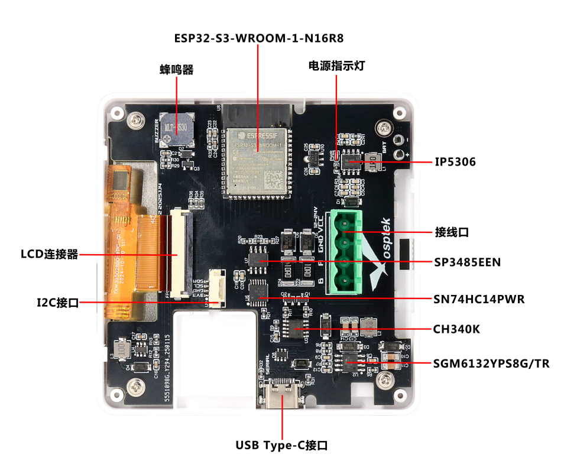
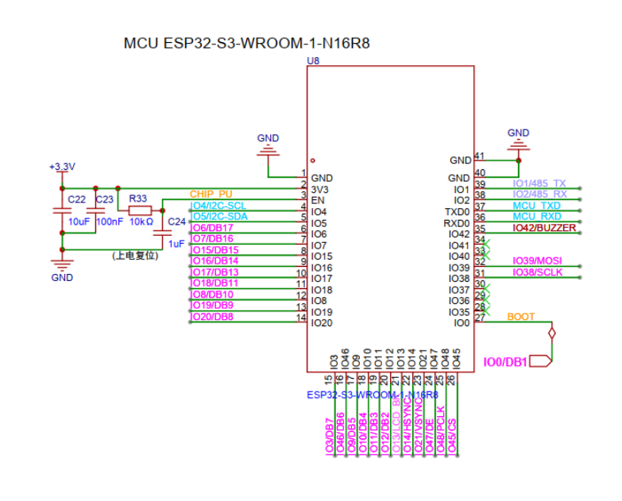
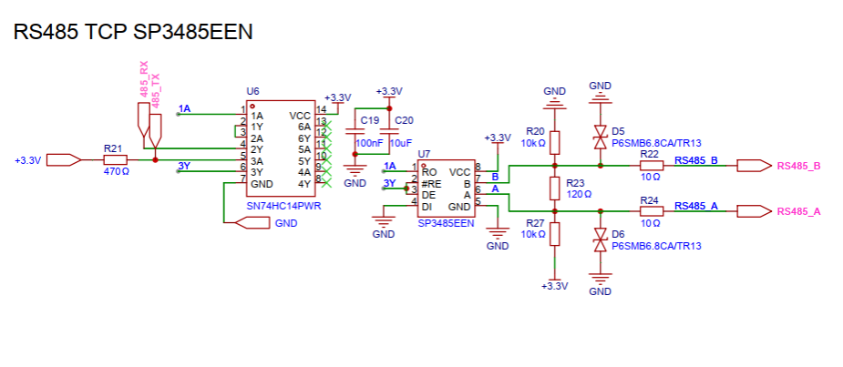

<p align="left"></p>

<h1 align="center">OSPTEK ESP32-S3-Touch-LCD-4 Touch Panel</h1>

<p align="center"><b>86-Type Panel · Touch UI · One RS485 Port</b></p>

<p align="center">English | <a href="./README.md">简体中文</a> · <a href="../../README_EN.md">Family index</a></p>

<p align="center">
  
  
  
  
  
</p>

<p align="center"></p>

## Contents

- [Overview](#overview)
- [Other SKUs in this series](#other-skus-in-this-series)
- [Features](#features)
- [Applications](#applications)
- [Specifications](#specifications)
- [Display](#display)
- [Hardware Resources](#hardware-resources)
- [Quick Start](#quick-start)
- [Examples](#examples)
- [Prebuilt Firmware](#prebuilt-firmware)
- [Repository Structure](#repository-structure)
- [Documentation](#documentation)
- [Where to Buy](#where-to-buy)
- [Support](#support)

---

## Overview

OSPTEK **ESP32-S3-Touch-LCD-4** is a **4-inch touch panel** based on an ESP32-S3 module (2.4 GHz Wi-Fi + Bluetooth LE 5), with **16 MB Flash** and **8 MB PSRAM**, and an onboard **YDP395B003-V4** (~3.95") **480×480** RGB capacitive touch display (driver **ST7701S**).

The main board is **ESP32-TPCB4**, with module **ESP32-S3-WROOM-1-N16R8**. It includes one **RS485** port, USB Type-C (power / flash / charge), an I²C sensor header, and a buzzer—suited as a finished product for smart control panels and interactive HMI.

## Features

- **4" square touch display**: YDP395B003-V4, 480×480, ST7701S + capacitive touch, ideal for 86-type panel UIs
- **ESP32-S3 MCU**: Wi-Fi + BLE 5, 16 MB Flash + 8 MB PSRAM
- **Industrial bus**: onboard RS485 (SP3485EEN + auto direction control) for field devices
- **Flexible power**: USB Type-C provides 5 V; terminal block supports **12–24 VDC** wide-range input (via DCDC)
- **Battery management**: IP5306 charge/discharge for battery-powered use
- **Easy debug**: CH340K USB-UART with auto-download (DTR/RTS control EN / IO0)
- **Expansion**: I²C sensor port, LCD FPC connector, onboard buzzer, and more

## Applications

- Smart home central control / 86-type interactive panels
- Home gateway and local HMI
- Industrial control and device status displays
- Smart lighting and building panels

## Specifications

### MCU & Memory

| Item | Specification |
| ---- | ------------- |
| Product model | ESP32-S3-Touch-LCD-4 |
| Main board | ESP32-TPCB4 |
| Module | ESP32-S3-WROOM-1-N16R8 |
| Flash | 16 MB |
| PSRAM | 8 MB |
| Wireless | 2.4 GHz Wi-Fi, Bluetooth LE 5 |

### Display & Touch

Summary below; full module parameters, driver, and touch details are in [Display](#display).

| Item | Specification |
| ---- | ------------- |
| Panel module | YDP395B003-V4 (~3.95") |
| Resolution | 480×480 |
| Driver IC | ST7701S |
| Display interface | RGB 18-bit |
| Touch | Capacitive (FT6336U, I²C) |
| Brightness | 350 cd/m² typ. |

### Interfaces & Power

| Item | Specification |
| ---- | ------------- |
| USB | Type-C (power, flash, charge) |
| USB-UART | CH340K (up to ~2 Mbaud) |
| RS485 | SP3485EEN, half-duplex; SN74HC14PWR auto direction |
| Terminal | 5.08 mm 4-pin |
| Sensor | I²C |
| Audio cue | Onboard buzzer |
| USB power | 5 V |
| Terminal power | 12–24 VDC (onboard DCDC to 5 V) |
| Power management | IP5306 (~2.1 A charge / 2.4 A discharge) |

## Display

This panel uses OSPTEK TFT module **YDP395B003-V4** with driver IC **ST7701S**, connected via the board LCD FPC. Touch is capacitive (I²C, FT6336U).

### Module Specifications (YDP395B003-V4)

| Item | Specification |
| ---- | ------------- |
| Module model | YDP395B003-V4 |
| Size | 3.95" (diagonal) |
| Display mode | Normally black |
| Resolution | 480 (H) RGB × 480 (V) |
| Dot pitch | 153 μm × 153 μm |
| Active area | 71.86 × 70.18 mm |
| Module outline | 74.66 × 76.54 × 2.06 mm |
| Color arrangement | RGB vertical stripe |
| Interface | RGB 18-bit (HSYNC / VSYNC / DE / DCLK); driver init via 3-wire SPI (SDA / SCL / CS) |
| Driver IC | ST7701S |
| Brightness | 350 cd/m² typ. (min. ~300) |
| Viewing angle | All view (typ. ~80°) |
| Contrast ratio | ~1000:1 typ. |
| Backlight | 8 white LEDs (typ. ~12 V / 40 mA) |
| Operating temp. | −20 ℃ ~ +70 ℃ |
| Storage temp. | −30 ℃ ~ +80 ℃ |

Touch signals such as `TP_SCL` / `TP_SDA` / `TP_INT` / `TP_RESET` are brought out on the same FPC; typical touch supply is 2.8–3.3 V.

### Display Documents

- [Panel datasheet YDP395B003-V4 (PDF)](./docs/YDP_395_B003_V4_d3e49044f9.pdf)
- [Driver IC ST7701S datasheet (PDF)](./docs/ST_7701_S_SPEC_V1_3_f82b940377.pdf)

## Hardware Resources

### Onboard Overview

| Resource | Description |
| -------- | ----------- |
| ESP32-S3-WROOM-1-N16R8 | Wi-Fi + BLE MCU module |
| Power LED | Red when powered |
| RS485 transceiver | SP3485EEN + auto direction circuit |
| USB bridge | CH340K |
| DCDC | SGM6132, wide-range input to 5 V |
| LCD connector | 0.5 mm-pitch FPC to the LCD |
| Buzzer | Onboard audio cue |

### Board Layout

<p align="center"></p>

More detailed text descriptions are in the [user guide](./docs/ESP32-S3-Touch-LCD-4_使用指南2025.3.14.pdf) (Chinese PDF).

### Schematic

Preview (excerpts):

<p align="center"></p>

<p align="center"></p>

Full PDF:

- [Full schematic (PDF)](./docs/SCH_Esp32s3_3.95in_RS485[模组]_R2_2025-02-05.pdf)

## Quick Start

1. Prepare: ESP32-S3-Touch-LCD-4, a data-capable USB cable (not charge-only), and a PC (Windows / Linux / macOS).
2. Connect USB between the PC and the panel USB port; the power LED should light.
3. **Verify the display (recommended)**: flash the prebuilt firmware in this repo—see [Prebuilt Firmware](#prebuilt-firmware).
   - On Windows, use Espressif’s graphical **[Flash Download Tools](https://www.espressif.com/en/support/download/other-tools)**.
   - Guide: [Flash Download Tool User Guide · ESP32-S3](https://docs.espressif.com/projects/esp-test-tools/en/latest/esp32s3/production_stage/tools/flash_download_tool.html)
4. **Application development**: build the [example](#examples) with ESP-IDF (auto-download via UART DTR/RTS; see schematic).

Hardware details:

- [User guide (PDF, Chinese)](./docs/ESP32-S3-Touch-LCD-4_使用指南2025.3.14.pdf)

Espressif tools & getting started:

- [Flash Download Tools (Windows)](https://www.espressif.com/en/support/download/other-tools)
- [ESP-IDF Get Started · ESP32-S3](https://docs.espressif.com/projects/esp-idf/en/latest/esp32s3/get-started/)
- [ESP-IDF 快速入门 · ESP32-S3（中文）](https://docs.espressif.com/projects/esp-idf/zh_CN/latest/esp32s3/get-started/)

## Examples

| Description | Path |
| ----------- | ---- |
| Display bring-up / LVGL demo (RGB ST7701, 480×480) | [`examples/esp32s3-3.95-tft-480x480-rgb-st7701-bringup/`](./examples/esp32s3-3.95-tft-480x480-rgb-st7701-bringup/) |

With ESP-IDF installed:

```bash
cd examples/esp32s3-3.95-tft-480x480-rgb-st7701-bringup
idf.py set-target esp32s3
idf.py build
idf.py -p <PORT> flash monitor
```

Component dependencies are managed by `main/idf_component.yml` and are fetched on the first build.

## Prebuilt Firmware

| File | Flash address | Description |
| ---- | ------------- | ----------- |
| [`firmware/esp32-s3-touch-lcd-4.bin`](./firmware/esp32-s3-touch-lcd-4.bin) | **`0x0`** | Merged image (bootloader + partition table + app) for the display example above |

Flash settings match the project: chip **ESP32-S3**, Flash **16 MB**, **DIO**, **80 MHz**. Write the merged package from address **`0x0`**.

### Option 1: Flash Download Tools (Windows, easiest)

1. Download and open Espressif **[Flash Download Tools](https://www.espressif.com/en/support/download/other-tools)**.
2. Set `ChipType` to **ESP32-S3**, `WorkMode` to Develop, `LoadMode` to UART.
3. Enable one row, select [`firmware/esp32-s3-touch-lcd-4.bin`](./firmware/esp32-s3-touch-lcd-4.bin), address **`0x0`** (do not use app-partition `0x10000`).
4. Set SPI SPEED / SPI MODE / FLASH SIZE as above (80 MHz, DIO, 16 MB).
5. Select the correct COM port and click **START**.

UI details: [Flash Download Tool User Guide · ESP32-S3](https://docs.espressif.com/projects/esp-test-tools/en/latest/esp32s3/production_stage/tools/flash_download_tool.html)

### Option 2: esptool (CLI)

Replace `<PORT>` with your serial port (e.g. `/dev/ttyUSB0`, `COM3`); address is **`0x0`**:

```bash
esptool.py --chip esp32s3 -p <PORT> write_flash 0x0 firmware/esp32-s3-touch-lcd-4.bin
```

## Repository layout

```text
esp32-s3-touch-lcd-4/                                # repo root (nav: ../../README_EN.md)
└── versions/
    └── ESP32-S3-Touch-LCD-4/                        # full materials for this SKU
        ├── README.md
        ├── README_EN.md
        ├── images/
        ├── docs/
        ├── firmware/
        └── examples/
```

## Documentation

### Product Documents

- [User guide (PDF, Chinese)](./docs/ESP32-S3-Touch-LCD-4_使用指南2025.3.14.pdf)
- [Full schematic (PDF)](./docs/SCH_Esp32s3_3.95in_RS485[模组]_R2_2025-02-05.pdf)
- [Panel datasheet YDP395B003-V4 (PDF)](./docs/YDP_395_B003_V4_d3e49044f9.pdf)
- [Driver IC ST7701S datasheet (PDF)](./docs/ST_7701_S_SPEC_V1_3_f82b940377.pdf)
- [Display example](./examples/esp32s3-3.95-tft-480x480-rgb-st7701-bringup/)
- [Prebuilt firmware esp32-s3-touch-lcd-4.bin](./firmware/esp32-s3-touch-lcd-4.bin)

### Chip Documents (Espressif)

- [ESP32-S3 product page](https://www.espressif.com/en/products/socs/esp32-s3)
- [ESP32-S3 系列产品页（中文）](https://www.espressif.com/zh-hans/products/socs/esp32-s3)
- [ESP-IDF Programming Guide · ESP32-S3](https://docs.espressif.com/projects/esp-idf/en/latest/esp32s3/index.html)
- [ESP-IDF 编程指南 · ESP32-S3（中文）](https://docs.espressif.com/projects/esp-idf/zh_CN/latest/esp32s3/index.html)

## Where to Buy

<p align="center">
  <a href="https://www.aliexpress.com/store/1105701619"></a>
  &nbsp;&nbsp;
  <a href="https://shop110742373.taobao.com/"></a>
</p>

**International (AliExpress)**

- Store: [OSPTEK Official Store](https://www.aliexpress.com/store/1105701619)

**China (Taobao)**

- Store: [鱼鹰光电工厂店](https://shop110742373.taobao.com/)

---

## Support

For technical questions or business inquiries:

- Technical support / product inquiry: <luyu@osptek.com>
- QQ technical group: **985881096**
- Website: <https://osptek.com/>
- Feel free to open an Issue in this repository if you have any questions

---

<p align="center"><sub>© 2026 OSPTEK · Materials in this repository are licensed under CC BY 4.0</sub></p>
